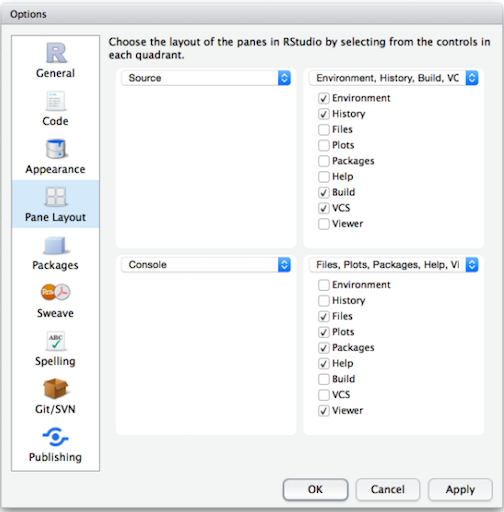
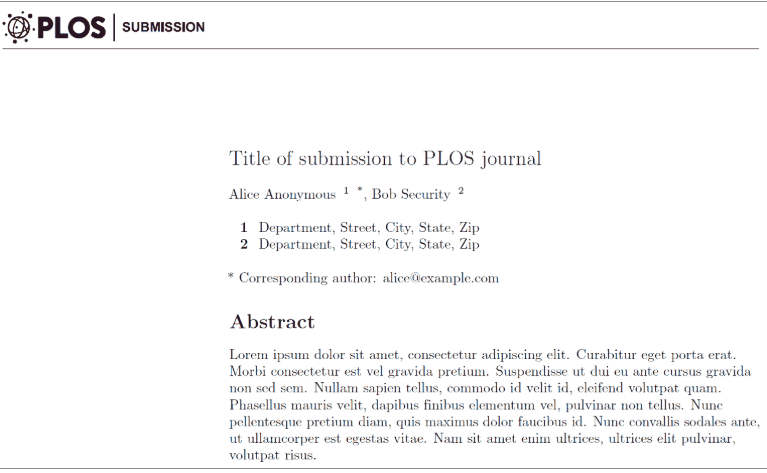
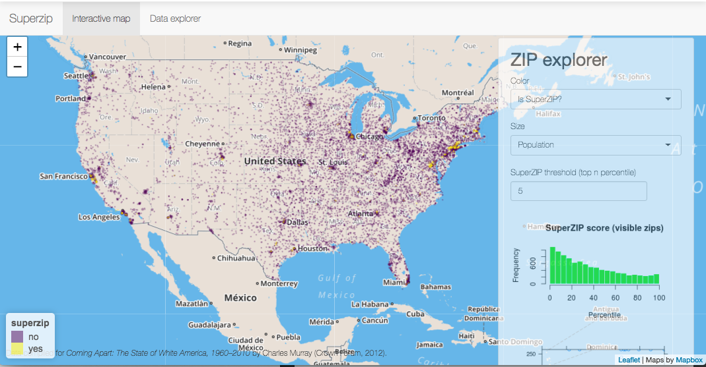

```{r, echo=FALSE}
knitr::opts_chunk$set(collapse = TRUE, comment = "#>", highlight = TRUE)
```

### Hello! While you wait for class to begin...

- Navigate to our class website: https://ksalazar3.github.io/HED696C_RClass/
  - Link is also provided in the updated syllabus on D2L
- On our class website, navigate to _Class Resources_ > _Syllabus & Class Resources_, and  download the following:
  - Folder Structure Zip File
- Under _Class Resources_ > _Introduction_  download the following:
  - Introduction PDF
  - Introduction Problem Set Rmd
- For now... just keep these files in your downloads folder

# Introductions

### Student introductions

1. Name
1. Pronouns
1. Academic program (and how far along) 
1. GA, RA, TA, and/or job?
1. Do you have any experience with R? If not, do you have experience with any other "statistical" software (e.g., SPSS, STATA) or coding languages (e.g., Python, SQL, Java)?
1. Why are you interested in this course?


### Karina Salazar, instructor

My start in data management/statistical analysis

- SPSS 
    - Evaluated retention programs within institutional research and assessment offices 
    - Student-level data on math remediation courses 
    - College Academy for Parents, Think Tank, Assessment Institute
- Stata 
    - Used loops and user-defined functions to work with national datasets (IPEDS, Survey of Earned Doctorates)

Got sick of the limitations of survey data and/or available data

- No survey asked questions on what I was interested in
    - Universities pledge commitment to access, but enrollments don't tell the whole story
    - Who do they actually recruit?
- We realized "data science" could create data from publicly available data sources
    - Twitter
    - Travel schedules on admissions websites

### Recruiting research program and "data science"

- Python 
    - web-scraping
    - connecting to Application Program Interfaces (API) (e.g., census data, Twitter, LinkedIn)
    - Natural Language Processing 
- R 
    - R can do all "data science" tasks Python can 
    - R can do all statistical analyses that Stata can (and more!)
    - R has amazing mapping capabilities 

Examples:

- [The off-campus recruiting project](https://emraresearch.org/)
- [Dissertation Defense](https://ksalazar3.github.io/defense/#/title)
    


# What is R?

### What is R?

According to the Inter-university consortium for political and social research [(ICPSR)](https://www.icpsr.umich.edu/icpsrweb/content/shared/ICPSR/faqs/what-is-r.html):

> R is "an alternative to traditional statistical packages such as SPSS, SAS, and Stata such that it is an extensible, open-source language and computing environment for Windows, Macintosh, UNIX, and Linux platforms. Such software allows for the user to freely distribute, study, change, and improve the software under the [Free Software Foundation's GNU General Public License](https://www.gnu.org/home.en.html)."

- For more info visit [R-project.org](https://www.r-project.org/about.html)

### Base R vs. R packages

There are "default" packages that come with [R](https://stat.ethz.ch/R-manual/R-devel/library/base/html/00Index.html). Some of these include:  

- `as.character`  
- `print`  
- `setwd`

And there are [R packages](http://r-pkgs.had.co.nz/intro.html) developed and shared by others. Some R packages include:  

- `tidyverse`  
- `stargazer`  
- `foreign`  

more about these in later weeks...

### Installing and Loading R packages
You only need to install a package once. To install an R package use `install.package()` function.
```{r warning=FALSE, message=FALSE}
#install.packages("tidyverse")
```

However, you need to load a package everytime you plan to use it. To load a package use the `library()` function. 
```{r}
library(tidyverse)
```
### RStudio

"[RStudio](https://www.rstudio.com/products/rstudio/features/) is an integrated development environment (IDE) for R. It includes a console, syntax-highlighting editor that supports direct code execution, as well as tools for plotting, history, debugging and workspace management."



### R Markdown Documents
[R Markdown](https://rmarkdown.rstudio.com/) produces dynamic output formats in html, pdf, MS Word, dashboards, Beamer (i.e., power point) presentations, etc.

- We will be using R Markdown for lectures and homework assignments
- These files names end with `.Rmd`
- Show ABOR Literature Review Example


### R Scripts
R Scripts are simply a text file containing all the same commands that you would enter on the command line of R. The "text" you can include in these files are in the form of comments.

- We will be using R Markdown for some homework assignments.
- These files names end with `.R`
- Create our first R Script!


### Why R? Capabilities of R
- [Graphs](https://ggplot2.tidyverse.org/)
- [Presentation](https://bookdown.org/yihui/rmarkdown/presentations.html)
- [Websites](https://bookdown.org/yihui/rmarkdown/websites.html)
- [Journals](https://bookdown.org/yihui/rmarkdown/journals.html) 
- [Interactive tutorials](https://rstudio.github.io/learnr/)
- [Web apps](http://shiny.rstudio.com/)
- [Dashbaords](https://rmarkdown.rstudio.com/flexdashboard/)
- [Books](https://bookdown.org/)  
- [Web scraping](https://www.analyticsvidhya.com/blog/2017/03/beginners-guide-on-web-scraping-in-r-using-rvest-with-hands-on-knowledge/)
- [Maps](http://pierreroudier.github.io/teaching/20170626-Pedometrics/20170626-soil-data.html)

For more info [visit](https://bookdown.org/yihui/rmarkdown/)

### Graphs 
- Create graphs with [ggplot2](https://ggplot2.tidyverse.org/) package 

```{r echo=FALSE, warning=FALSE}
# Source: http://r-statistics.co/Top50-Ggplot2-Visualizations-MasterList-R-Code.html
# install.packages("ggplot2")
# load package and data
options(scipen=999)  # turn-off scientific notation like 1e+48
library(ggplot2)
theme_set(theme_bw())  # pre-set the bw theme.
data("midwest", package = "ggplot2")
# midwest <- read.csv("http://goo.gl/G1K41K")  # bkup data source

# Scatterplot
gg <- ggplot(midwest, aes(x=area, y=poptotal)) + 
  geom_point(aes(col=state, size=popdensity)) + 
  geom_smooth(method="loess", se=F, formula = 'y ~ x') + 
  xlim(c(0, 0.1)) + 
  ylim(c(0, 500000)) + 
  labs(subtitle="Area Vs Population", 
       y="Population", 
       x="Area", 
       title="Scatterplot", 
       caption = "Source: midwest")

plot(gg)
```

### Journal articles
- Journal articles with [rticles](https://github.com/rstudio/rticles) package


### Interactive web apps
- Interactive web apps with [shiny](http://shiny.rstudio.com/) package


### Mapping 
- Mapping with [sf](http://strimas.com/r/tidy-sf/) package & ggplot


# What is this course about?

### What is data management?

- All the stuff you have to do to create analysis datasets that are ready to analyze:
    - Collect data
    - Read/import data into statistical programming language
    - Clean data
    - Integrate data from multiple sources (e.g, join/merge, append)
    - Change organizational structure of data so it is suitable for analysis
    - Create "analysis variables" from "input variables"
    - Make sure that you have created analysis variables correctly

### Why I don't call this class "R for data science"

Data management and manipulation is the building blocks of data science!

- Data Science implies doing "fancy" things like mapping, network analysis, web-scraping, etc.
- But if you don't know how to clean data, these "fancy" analyses and visualizations will be impossible to execute
- "80% of data science is data cleaning"
- The skills you learn in this data management class are foundational to data science tasks! (and a prerequisite to taking my data science seminar next semester)

### Who is this class for?

This class is for anyone who wants to work with data, that is people who want to be:

- Researchers working with survey data and doing traditional statistical analyses
- Researchers who want to do "data science" oriented research involving mapping, NLP, connecting to APIs
- Analysts working at think tanks or non-profits that work with large federal or state datasets

# Course logistics

### Course logistics

- follow the syllabus


### Modality Poll

- The first few weeks of the course:
  - Focus on getting everyone comfortable with R
  - We will likely take up the full class time 
    - Troubleshoot errors in-class, together
    - Covering material in "traditional" lecture style
    
    
- Starting week 4 (after Labor Day), the class becomes easier to incorporate an asynchronous component
  - __Asynchronous BEFORE WEEKLY WORKSHOP CLASS__
    - Short readings from textbooks
    - Watch ~30 min lecture overview recording by instructor
    - Read/Execute Code in lecture "slides"
  - __Synchronous 1-HOUR WEEKLY WORKSHOP CLASS__
    - Instructor will break class up into 2-3 small groups (probably one in-person and one on-Zoom)
    - Groups will work through class materials or the weekly problem set together
    - Instructor will move from group to group helping and answering questions
    - Students will need to complete and submit the problem set prior to starting the asynchronous material for next class...
    
    
- Take Zoom Poll
  - Would you like to move to an asynchronous option?
    
# 10 Min Break    

# Create "R project" and directory structure

### What is an R project? Why are you doing this?

What is an "R project"?

- Helps you keep all files for a project in one place
- When you open an R project, the file-path of your current working directory is automatically set to the file-path of your R-project

Why am I asking you to create R project and download a specific directory structure?

- I want you to be able to run the .Rmd and .R files for each lecture on your own computer
- Sometimes these .Rmd and .R files point to certain sub-folders
- If you create R project and create directory structure I recommend, you will be able to run .Rmd and .R files from your own computer without making any changes to file-paths!
- This process allows us all to work off our individual computers but to "start" in the same working directory (R Project) and be able to navigate to other "shared" folders (same folder structure) 

### Follow these steps to create "R project" and directory structure

1. In your downloads folder, you'll have a zip file: 
    - Unzip the folder: this is a shell of the file directory you should use for this class
    - Move it to your preferred location (e.g, documents, desktop, dropbox, etc)

2. You should also have one .Rmd and one PDF file in your downloads folder

  - Move the __introduction.pdf__ file into _"HED696C_Rclass/modules/introduction"_
  - Move the __introduction_ps.Rmd__ file into _"HED696C_Rclass/problemsets/introduction"_

3. In RStudio, click on "File" >> "New Project" >> "Existing Directory" >> Navigate to the HED696C_Rclass folder >> Create Directory    

### After you follow these steps

- You can add any additional sub-folders you want to the "rclass" folder
    - e.g., "syllabus", "resources"
- You can add any additional files you want to the sub-directory folders you unzipped
    - e.g., in "HED696C_Rclass/modules/module1" you might add an additional document of notes you took


# Directories and filepaths 

### Working directory

__(Current) Working directory__

- The folder/directory in which you are currently working
- This is where R "automatically" looks for files
- Files located in your current working directory can be accessed without specifying a filepath because R automatically looks in this folder

Function `getwd()` shows current working directory
```{r}
getwd()
```
Command `list.files()` lists all files located in working directory
```{r}
getwd()
list.files()
```

### Working directory, "Code chunks" vs. "console" and "R scripts"

When you run __code chunks__ in RMarkdown files (.Rmd), the working directory is set to the filepath where the .Rmd file is stored

```{r}
getwd()
list.files()
```

When you run code from the __R Console__ or an __R Script__, the working directory is....


Command `getwd()` shows current working directory
```{r}
getwd()
```

### Absolute vs. relative filepath  
**Absolute file path**:  The absolute file path is the complete list of directories needed to locate a file or folder.  
`setwd("Users/Karina/rclass/modules/module2")`


**Relative file path**:  The relative file path is the path relative to your current location/directory. Assuming your current working directory is in the "lecture2" folder and you want to change your directory to the data folder, your relative file path would look something like this:  
`setwd("../../data")`  

            File path shortcuts

| **Key** | **Description** |
| ------ | -------- |
| ~    | tilde is a shortcut for user's home directory (mine is my name)   |
| ../    | moves up a level   |
| ../../    | moves up two levels   |


### Install TinyTex

- Why am I asking you to do this?
  - You will need to install LaTeX (lah-tech or lay-tech) on your computer to create pdf documents in R Markdown files (.Rmd)
  - You do not need to know how to use LaTeX. LaTeX is used in the background to compile pdf documents for you.
  - [Here](https://medium.com/@sorenlind/create-pdf-reports-using-r-r-markdown-latex-and-knitr-on-macos-high-sierra-e7b5705c9fd) is a helpful article on creating PDf reports using R, R Markdown, LaTeX, and knitr.


- Instructions for installing tinytex 
  - [Here](https://yihui.name/tinytex/) is a helpful link to install tinytex  
    
    1. Open up RStudio  
    2. In the "console" paste the following and hit return(enter): __install.packages('tinytex')__  
    3. Once the package is installed, paste the following code in the "console" and hit return(enter): __tinytex::install_tinytex()__  
    
### Intro Problem Set and Knit

- Open the _introduction_ps.Rmd_
- Let's knit to pdf!

### Next Week

- Reading: 
  - Wickham, H., & Grolemund, G. (2018). _R for Data Science_. http://r4ds.had.co.nz/
  -  1 Introduction, 2 Explore Introduction, 4 Workflow: basics, 20.1-20.3 Vectors
- Watch videos on Working with directories and filepaths (only if you need the extra help):
  - Absolute versus relative file paths [Youtube link](https://www.youtube.com/watch?v=ephId3mYu9o)
  - Relative paths and working directory in R [Youtube link](https://www.youtube.com/watch?v=fe6GA200dks)  
- "Intro Problem Set": practice downloading data, knitting to PDF, and working with directories
  - always submit completed assignments to D2L!